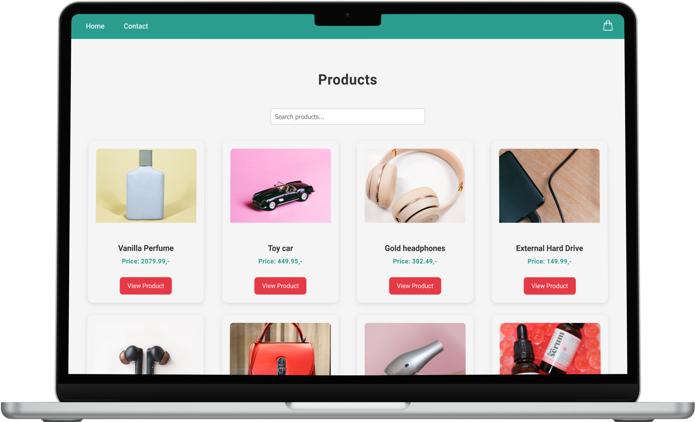

# E-Commerce Store (React + TypeScript)



This is a fully functional e-commerce application built with React, TypeScript, and Vite. It is styled using Styled Components and demonstrates industry best practices in component-based architecture, routing, and state management. The project is designed as a professional portfolio piece, showcasing my knowledge of modern JavaScript frameworks and development patterns.

## Key Features

- **Home Page:** Displays a list of products fetched from an API with a lookahead/auto-complete search bar for filtering products based on input.
- **Product Page:** Dynamically generated individual product pages based on the product ID, using React Router dynamic segments.
- **Cart Functionality:** Users can add products to the cart, view the cart, update quantities, and remove items.
- **Checkout Page:** Summarizes the items in the cart and displays a total price along with a checkout button.
- **Checkout Success Page:** Confirms that the order was successful and clears the cart, allowing the user to return to the store.
- **Contact Page:** Includes a form with validation (Full name, Subject, Email, and Message) to ensure proper submission.
- **Responsive Design:** The app is fully responsive and adapts to various screen sizes, providing a smooth experience on both desktop and mobile.

## Tech Stack

- **React + TypeScript:** For building interactive and maintainable UI components with strict type checking.
- **Vite:** A fast build tool optimized for React and TypeScript development.
- **Styled Components:** For styling React components with a modern, scoped CSS approach.
- **React Router:** For seamless client-side routing and dynamic page generation.
- **API Integration:** Fetches product data dynamically from a REST API.

## Installation and Setup

1. Clone the repository to your local machine:
```git clone https://github.com/chralmli/front-end-frameworks-ca.git```

2. Navigate into the project directory
```cd ecom-store/front-end-frameworks-ca```

3. Install the project dependencies
```npm install```

4. Create a .env file in the root directory and add your API URL:
```VITE_API_BASE_URL=https://v2.api.noroff.dev/online-shop```

5. Start the development server
```npm run dev```

## Functionality Overview

### Home Page

- Displays a list of products fetched from the API.
- Features a lookahead/auto-complete search bar that filters products based on the user's input. Clicking on a product in the search results navigates the user to the product detail page.
- Utilizes modern JavaScript best practices, such as debouncing input for a smoother search experience.

### Product Page

- Dynamically rendered based on the selected product’s ID.
- Fetches and displays detailed product information, including title, description, price, and an optional discounted price.
- Users can add the product to the cart and are notified with an "Added to Cart" animation.

### Cart Functionality

- A cart icon on the navigation bar shows the current number of items in the cart.
- Clicking the cart icon takes users to the **Checkout Page** where they can view all items, adjust quantities, and remove products.
- Cart state is managed using React's Context API, ensuring the cart is persistent across different components.

### Checkout Page

- Displays a summary of the items in the cart, including total price.
- Provides a **Checkout** button that finalizes the order and navigates to the **Checkout Success Page**.

### Checkout Success Page

- Displays a confirmation message after a successful order.
- Clears the cart and provides a link to return to the homepage.

### Contact Page

- A fully functional contact form that validates the user's input before submission:
  - **Full Name:** Required, minimum 3 characters.
  - **Subject:** Required, minimum 3 characters.
  - **Email:** Must be a valid email address.
  - **Message:** Required, minimum 3 characters.

## Project Architecture and Best Practices

- **Component-Based Architecture:** Each component is isolated in its own directory, ensuring modularity and reusability.
- **React Router:** Used for client-side routing, enabling dynamic page rendering based on the product ID.
- **TypeScript Integration:** Provides strict type safety, improving code reliability and reducing runtime errors.
- **API Integration:** Fetches data from an external REST API, providing real-time product information and enabling dynamic content rendering.
- **Responsive Design:** The app uses media queries and flexible layouts to ensure that it looks great on all screen sizes.

## Challenges and Reflections

Building this e-commerce store has given me deep insight into the power of React combined with TypeScript. I’ve adhered to industry best practices by using component-based architecture, avoiding code duplication, and maintaining state across different parts of the application. One of the most significant challenges was ensuring responsive behavior across all devices, which was solved using media queries and flexbox layouts in Styled Components.

I’ve also gained valuable experience in handling asynchronous data fetching with `useEffect` and managing global state with React Context. Reflecting on the entire project, I can see how important modularity, readability, and reusability are when building scalable applications.

## Conclusion

This project demonstrates my ability to plan, design, and build a fully functional digital solution using modern JavaScript frameworks. It highlights my skills in React, TypeScript, API integration, and responsive design, while also showcasing my understanding of software architecture and industry best practices.

## Live Demo

Check out the live site here: [https://crimson-cart.netlify.app/](https://crimson-cart.netlify.app/)
